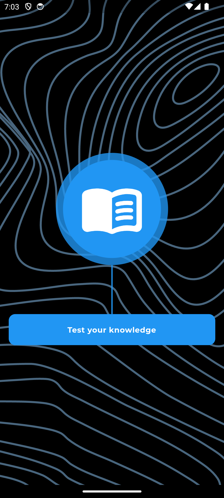
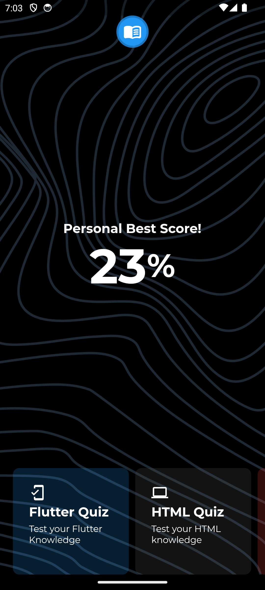
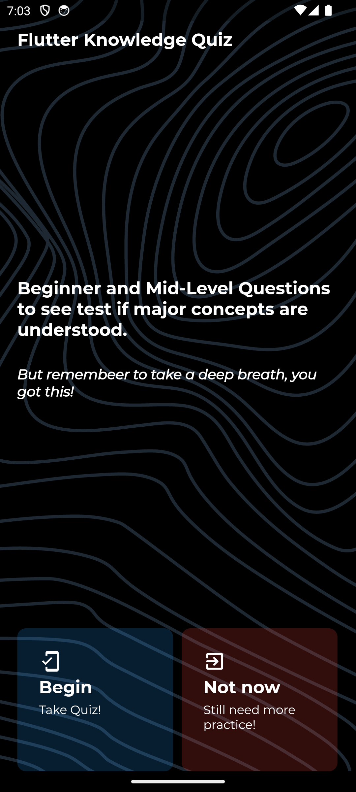
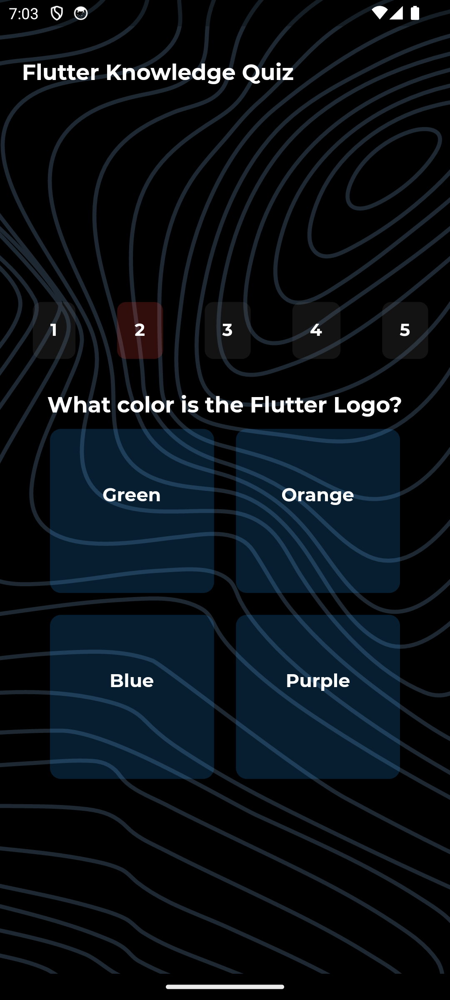
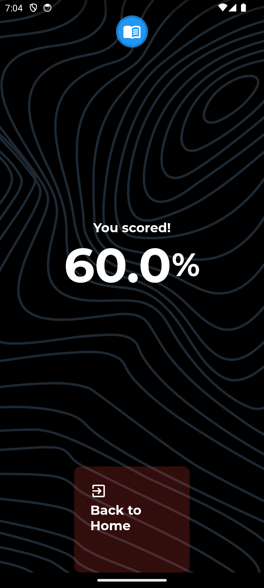

# LearnlyApp Mobile Engineer Assessment


## Installation
1. Find an apk file in the this [link](https://drive.google.com/drive/folders/1T0QDAiJyClkCi0qIyXEdtzNhcdehpPxz?usp=sharing).

or 

1. Make sure you have [Flutter](https://flutter.dev/docs/get-started/install) and its dependencies installed on your device.
2. Clone the repository: `git clone https://github.com/yourusername/my-app.git`
3. Go to the project directory: `cd my-app`
4. Run `flutter pub get` to install the dependencies.
5. Run `flutter run` to start the app on an emulator or connected device.


## User Interface
The Quiz app features the principle "Component Driven Design" which enables a clean and user-friendly interface, with widgets broken down into several components, following the DRY principle to enable easier maitenance and usabiliy.

## Technical details
- The application is built with Flutter, using the Dart programming language.
- The major state management used is "Provider".
- The app intends to follows functional, object oriented and imperative programming paradigms.


## Feature Interface
- [x] Get Started 
- [x] Dashboard
- [x] Prep Quiz Page
- [x] Quiz Questions and Options Page
- [x] Quiz Score Page


## Screenshots

| Get Started Screen | Dashboard Screen | 
|    :---:     |     :---:      |  
|    |    |

| Prep Quiz Screen | Quiz Screen | 
|    :---:     |     :---:      |  
|    |    |

| Quiz Score Screen | 
|    :---:     |   
|    | 

## Running Tests 

To run all unit tests use the following command:

```flutter test```
